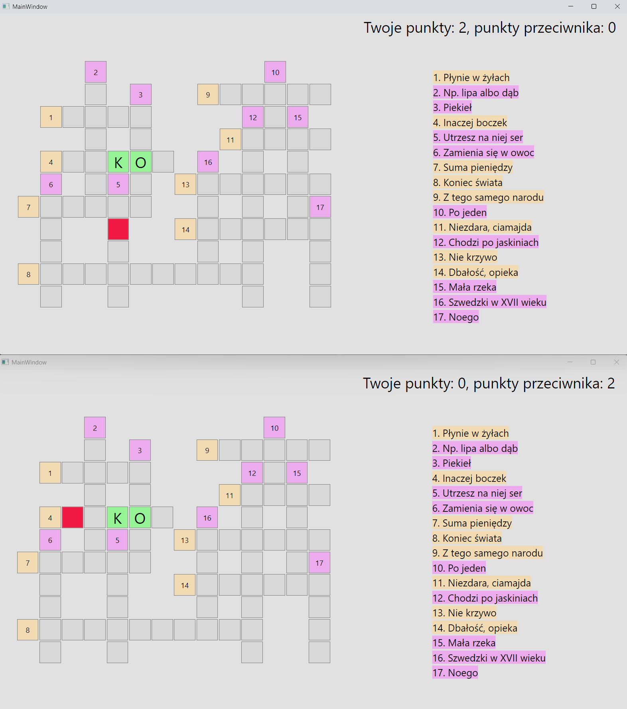
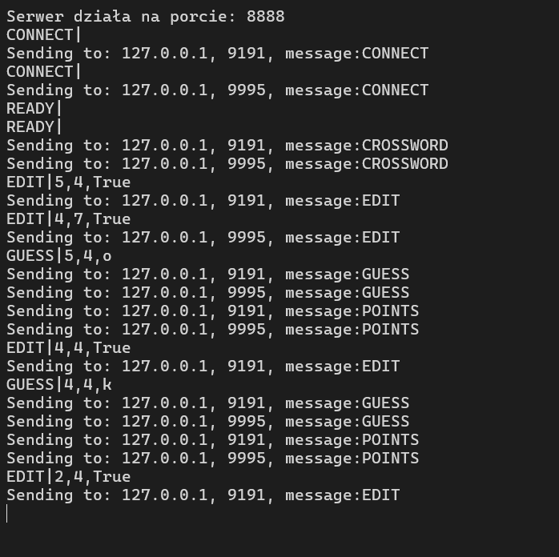

# Crossword Duel – UDP Multiplayer Game

A real‑time, competitive crossword puzzle for two players built with .NET (WPF client, console server) and UDP sockets.  
Each correct letter earns a point – race to solve the same board while blocking your opponent’s moves.

## Gameplay
1. Both players connect to the server and signal they are **Ready**.
2. The server sends the crossword (loaded from a JSON file) to both clients simultaneously.
3. Players see the same grid and clues.
4. **Editing a field:**  
   Click a cell – it becomes locked for the other player, preventing them from typing there. You can then type a letter.
5. **Guessing:**  
   Press Enter to submit the letter.  
   - **Correct** → the cell is marked with the correct character, you earn +1 point, and it can no longer be edited by either player.  
   - **Incorrect** → you lose 1 point, the lock is released, and the field is open again.
6. Points are updated and displayed live on both screens.
7. When all cells are filled correctly, the server declares the winner (or a draw) and both players return to the ready state.

## Architecture

### Server (Console App)
- Listens on a UDP socket (default port 8888).
- Manages exactly two player endpoints (`player1`, `player2`).
- Processes messages in a multithreaded fashion – each incoming datagram spawns a new `Thread` that handles the message via events (`PlayerReady`, `FieldEdit`, `FieldGuess`, etc.).
- Validates moves, updates the shared crossword state, and broadcasts changes to both clients.
- Resets the game when a match ends or a player disconnects.

### Client (WPF Application)
- A single `UdpClient` sends and receives messages asynchronously.
- Navigation between pages:  
  `Connect` → `Ready` → `Game` → `EndGame`.
- The **GamePage** dynamically builds the crossword grid and clue list from the received data.
- A `MessageHandler` parses server messages and raises events to update the UI (lock cells, reveal correct letters, update score).
- The ViewModel (`GamePageViewModel`) handles cell creation, grid definitions, and bindings.

## Communication Protocol
All messages are UTF‑8 strings with a `|` separator:

| Type         | Format                                | Direction       | Purpose                             |
|--------------|---------------------------------------|-----------------|-------------------------------------|
| `CONNECT`    | `CONNECT\|`                           | Client → Server | Request to join                     |
| `CONNECT`    | `CONNECT\|ok`                         | Server → Client | Connection accepted                 |
| `CROSSWORD`  | `CROSSWORD\|<JSON array of clues>`    | Server → Client | Send crossword definition           |
| `EDIT`       | `EDIT\|x,y,true/false`                | Both            | Lock/unlock a cell (true = editing) |
| `GUESS`      | `GUESS\|x,y,correctChar`              | Server → Client | Reveal a correctly guessed letter   |
| `POINTS`     | `POINTS\|playerPts,enemyPts`          | Server → Client | Update score display                |
| `COMPLETE`   | `COMPLETE\|VICTORY/DEFEAT/DRAW,p1,p2` | Server → Client | Game over with result               |
| `DISCONNECT` | `DISCONNECT\|`                        | Server → Client | Opponent left the match             |

## Screenshots

## How to Run
1. **Server**  
   - Run the `CrosswordServer.exe` console app.  
   - It listens on `0.0.0.0:8888` (configurable in code).  
   - The crossword data is read from `Data/data.json`.

2. **Client**  
   - Run `Crosswords.exe` app.  
   - Enter the server IP and port on the `ConnectPage`, then press **Connect**.  
   - Wait for another player, then click **Ready**. The game starts automatically.
   - Play using mouse clicks and keyboard (Enter to guess).  

---
*A study in real‑time concurrency, UDP communication, and event‑driven UI design.*